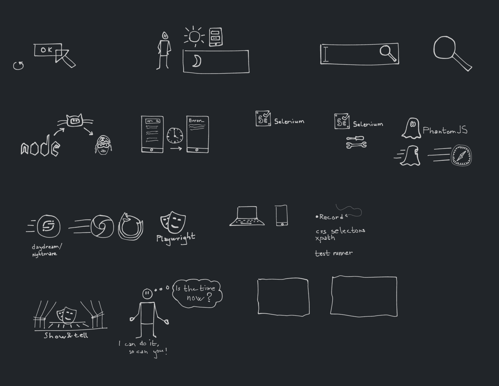

# drawings-and-illustrations
Drawings and illustrations I create to communicate. Testing [`tldraw;`](https://github.com/tldraw/) extension for VS code to get a better workflow.

## User interface regression testing - Is the time now?
Illustrations for a presentation + show and tell at Knowit Developer Summit - 2021.11.13
